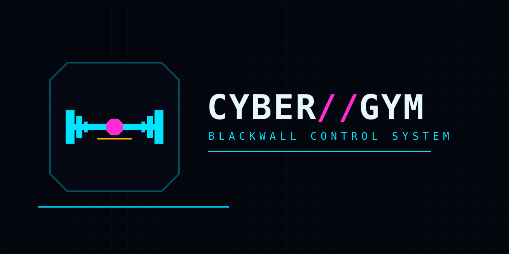

# Cyber Gym



**Персональный дневник тренировок и веса тела.** Программы, подходы, повторения, отдых,
рекорды, статистика и ИИ-тренер — в одном тёмном интерфейсе, который работает как
приложение на телефоне и как сайт на своём сервере.

> **Blackwall** — так называется дизайн-система Cyber Gym: почти чёрный фон, тонкие
> бирюзовые линии, рубленые углы и телеметрия моноширинным шрифтом. Светлой темы нет —
> это осознанное решение, а не недоделка.

## Что умеет

- **Тренировка по ходу.** Подходы, повторения, вес, время под нагрузкой, кардио, суперсеты,
  дроп-сеты и рест-пауза. Экран рассчитан на одну руку.
- **Программы и план недели.** Готовые стартовые планы (Push/Pull/Legs, Upper/Lower,
  Full Body, 5×5) или свои. Перестановка дней, замена упражнений, копирование программ.
- **Библиотека упражнений** с анимациями, фильтрами по мышцам и инвентарю, поиском и
  разбором по группам мышц.
- **Статистика.** Объём, рекорды, расчётный 1ПМ, прогресс по упражнениям, тепловая карта
  активности, карта мышц и восстановление.
- **Дневник веса** с целью и кривой прогресса.
- **Импорт** из FitNotes, Strong, Hevy и Apple Health.
- **ИИ-тренер** — необязательный. Собирает план и разбирает то, что реально записано;
  работает через ваш собственный ключ у провайдера или через локальную модель.
- **Ключи доступа (passkeys)** вместо паролей, синхронизация между устройствами,
  приложение для Android и iOS.
- **Честная приватность.** Данные лежат на вашем сервере или в вашем браузере. Никакой
  телеметрии по умолчанию.

## Как это устроено

| Часть | Стек | Где живёт |
|---|---|---|
| Веб-клиент | React 19, Vite, Zustand | `frontend/` |
| API | Node без фреймворка, WebAuthn, web-push | `api/` |
| MCP-мост | Node, Model Context Protocol | `mcp/` |
| Веб-сервер | nginx (проксирует `/api`) | `web/` |
| Приложения | Capacitor (Android/iOS) | `frontend/android`, `frontend/ios` |
| Сайт | статический HTML | `website/` |

Состояние — один JSON на профиль плюс `db.json` с пользователями и ключами доступа.
Никакой внешней базы не требуется.

## Быстрый старт

### Docker (рекомендуется)

```bash
cp .env.example .env
# RP_ID и ORIGIN должны указывать на ваш домен, иначе ключи доступа не сработают
docker compose up -d
```

Откройте `http://localhost:8080` для локальной проверки или свой домен за HTTPS-прокси.
Первый запуск скачивает медиа упражнений (~140 МБ) в `./media` — они не лежат в репозитории.

### Разработка

```bash
cd frontend && npm ci && npm run dev     # клиент на http://localhost:5173
cd api && npm ci && npm start            # API на http://localhost:3000
cd mcp && npm ci && npm test             # MCP-мост
```

### Мобильные сборки

```bash
cd frontend
npm run build:mobile                     # сборка + cap sync
cd android && ./gradlew assembleDebug    # ANDROID_HOME должен быть выставлен
```

Для iOS откройте `frontend/ios/App/App.xcworkspace` в Xcode на macOS.

## Тесты и проверка

```bash
cd frontend && npm test                  # 126 файлов тестов
cd api && npm test                       # node --test
cd mcp && npm test                       # vitest
cd frontend && npm run build             # production-сборка
docker compose config -q                 # валидность compose
```

## Приватность и самостоятельный хостинг

- Приложение не отправляет данные никуда, кроме вашего собственного сервера.
- Пуш-уведомления идут через штатный web-push и только на устройства, которые вы сами
  подписали.
- ИИ-тренер выключен, пока вы его не включите, и вы сами выбираете, какой ключ он
  использует. Каждое изменение плана подтверждает человек.
- Инструкции по развёртыванию, HTTPS и обратному прокси — в [docs/SELF_HOSTING.md](docs/SELF_HOSTING.md).

## Лицензия

Cyber Gym распространяется под **GNU AGPL v3.0** — полный текст в [LICENSE](LICENSE).

Это производная работа: исходная кодовая база была взята как открытый проект под AGPL и
существенно переработана. Обязательная атрибуция и notices третьих сторон сохранены в
[NOTICE.md](NOTICE.md).

Исходный код: <https://github.com/Kurubik/cyber-gym>
